<!-- ===================== HERO ===================== -->

<table border="0" width="100%"> <tr> <td width="65%" valign="middle">

<h1 align="center">Hi, I'm Alina</h1>

<h3 align="center">Data Scientist · Data Engineer · Machine Learning</h3>

</td>

<td width="35%" align="center" valign="middle">
  
</td> </tr> </table>

<!-- ===================== ABOUT ===================== -->

I'm a **Data Scientist** interested in building machine learning solutions that connect rigorous analysis with real-world impact.

My work spans the full data science workflow from **data preprocessing and feature engineering** to **predictive modeling, model evaluation, optimization, and interpretation**.

I enjoy working with complex structured datasets, experimenting with different modeling approaches, and using evidence from both **data and research literature** to identify solutions that are reliable, interpretable, and useful.

###  What I work with

*  **Machine Learning & Predictive Modeling**
*  **Data Analysis & Statistical Modeling**
*  **Feature Engineering & Selection**
*  **Explainable & Evidence-Based AI**
*  **Data Visualization & Storytelling**
*  **Applied ML & Healthcare Analytics**
*  **Business Analytics & Decision Support**

I'm particularly interested in opportunities where **data science, machine learning, and real-world decision-making** come together.

 

<!-- ===================== CURRENT FOCUS ===================== -->

##  Currently Exploring:

<table>
<tr>
<td width="50%">

###  Machine Learning:

Predictive modeling, feature engineering, model optimization, validation strategies, and interpretable machine learning.

</td>

<td width="50%">

###  Analytics:

Statistical analysis, experimentation, business intelligence, dashboards, and translating complex data into understandable insights.

</td>
</tr>

<tr>
<td width="50%">

###  ML Engineering:

Experiment tracking, reproducible pipelines, deployment workflows, and production-oriented machine learning.\
</td>

<td width="50%">

###  Research:

Literature-driven problem-solving and exploring how machine learning can be applied across different domains.\

</td>
</tr>
</table>

 

<!-- ===================== FEATURED PROJECTS ===================== -->

##  Featured Projects:

###  ICON: In-Patient Day Surgery Optimization

**Machine Learning · Healthcare · Predictive Modeling · Django**

Contributed to a machine learning solution for **surgical duration prediction**.

My work included:

* Feature engineering and feature preparation
* Hyperparameter tuning
* Predictive model training
* Feature selection and interpretation
* Data preprocessing and evaluation
* Integration of predictions into a clinical workflow through a Django application

> A project at the intersection of **machine learning, healthcare operations, and decision support**.

---

###  Emotion Recognition from Voice using Python

**Machine Learning · Audio Processing · Classification**

Bachelor's thesis focused on recognizing emotions from speech using acoustic features including:

* MFCC
* Pitch
* Tempo

Built and evaluated machine learning pipelines using **SVM and Random Forest**, achieving approximately **80–85% accuracy**.

---

###  Weapon & Sensitive Content Detection

**Computer Vision · Deep Learning · Object Detection**

Developed a deep learning-based computer vision system for identifying weapons such as knives in images and video frames, including **region-based localization** of detected objects.

---

###  Chest X-Ray Pneumonia Detection

**Computer Vision · Deep Learning · Medical Imaging**

Developed deep learning models for:

* Normal vs. Pneumonia classification
* Bacterial vs. Viral classification

Focused on applying computer vision techniques to support medical image analysis.

 

<!-- ===================== OTHER PROJECTS ===================== -->

##  Other Projects:

| Area                     | Project                       | Focus                                           |
| ------------------------ | ----------------------------- | ----------------------------------------------- |
|  Data Science            | COVID-19 Vaccination Analysis | Logistic regression & odds ratios               |
|  Regression              | Body Measurements             | Linear regression & AIC/BIC                     |
|  ML                      | Income Classification         | Model comparison, imputation & cross-validation |
|  NLP                     | Bundestag Plenary Speeches    | Topic modeling & sentiment analysis             |
|  NLP                     | Literature Review             | Text mining & full-text analysis                |
|  Statistics              | Music Performance Anxiety     | Multilevel modeling                             |
|  Statistics              | Swimming Data                 | ANOVA & multiple testing                        |
|  Experimental Analysis   | Anchoring Effect              | Two-way ANOVA                                   |
|  Data Analysis           | U.S. Census IDB               | Demographic trends                              |
|  Data Analysis           | Hospital In-Patient Diagnosis | EDA & hospital stay patterns                    |
|  Data Analysis           | Crime Control Spending        | Statistical analysis                            |
|  Linguistics             | Linguistic Landscaping        | Categorical data analysis                       |
|  Application             | Digital Life Journey          | Flutter & UX                                    |
|  Application             | SheMasomo                     | Flutter & accessible UX                         |

 

<!-- ===================== TECH STACK ===================== -->

##  Tech Stack:

###  Data Science & Machine Learning

**Libraries & Tools**

`pandas` · `NumPy` · `scikit-learn` · `TensorFlow` · `PyTorch` · `Matplotlib` · `statsmodels` · `Optuna` · `Transformers`

---

###  Data & Analytics

`SQL` · `Excel` · `Statistical Inference` · `Predictive Modeling` · `A/B Testing` · `Dashboarding` · `Data Storytelling` · `KPI Design`

---

###  Programming & Development

---

###  Frameworks & Tools

Also experienced with **Spring Boot, Bootstrap, Material UI, WordPress, Photoshop, Illustrator, XD, and After Effects**.

 

<!-- ===================== CURRENTLY LEARNING ===================== -->

##  Currently Learning:

   

Continuously expanding from model development → reproducible ML workflows → deployment and analytics.

 

<!-- ===================== GITHUB STATS ===================== -->

##  GitHub Activity

<picture> <source media="(prefers-color-scheme: dark)" srcset="./profile/stats-dark.svg" /> <source media="(prefers-color-scheme: light)" srcset="./profile/stats.svg" />  </picture>

  

<picture> <source media="(prefers-color-scheme: dark)" srcset="./profile/top-langs-dark.svg" /> <source media="(prefers-color-scheme: light)" srcset="./profile/top-langs.svg" />  </picture>

 

 

<!-- ===================== SNAKE ===================== -->

## Contribution Snake:

<picture>
  <source
    media="(prefers-color-scheme: dark)"
    srcset="https://raw.githubusercontent.com/AlinaImtiaz018/AlinaImtiaz018/output/github-contribution-grid-snake-dark.svg"
  />
  <source
    media="(prefers-color-scheme: light)"
    srcset="https://raw.githubusercontent.com/AlinaImtiaz018/AlinaImtiaz018/output/github-contribution-grid-snake.svg"
  />
  
</picture>

 

<!-- ===================== PERSONAL ===================== -->

## Beyond the Code:

When I'm not exploring datasets or building models, you'll usually find me:

* Gaming
* Painting
* Singing
* Photography

I enjoy the creative side of technology too, especially finding ways to turn complex information into something clear, useful, and visually engaging.

 

<!-- ===================== PORTFOLIO ===================== -->

 
  
## Want to see more?

 

 &nbsp;  &nbsp; 
 

 

<i> Building with data, learning continuously, and turning ideas into useful solutions.</i>

<!-- ===================== END ===================== -->
